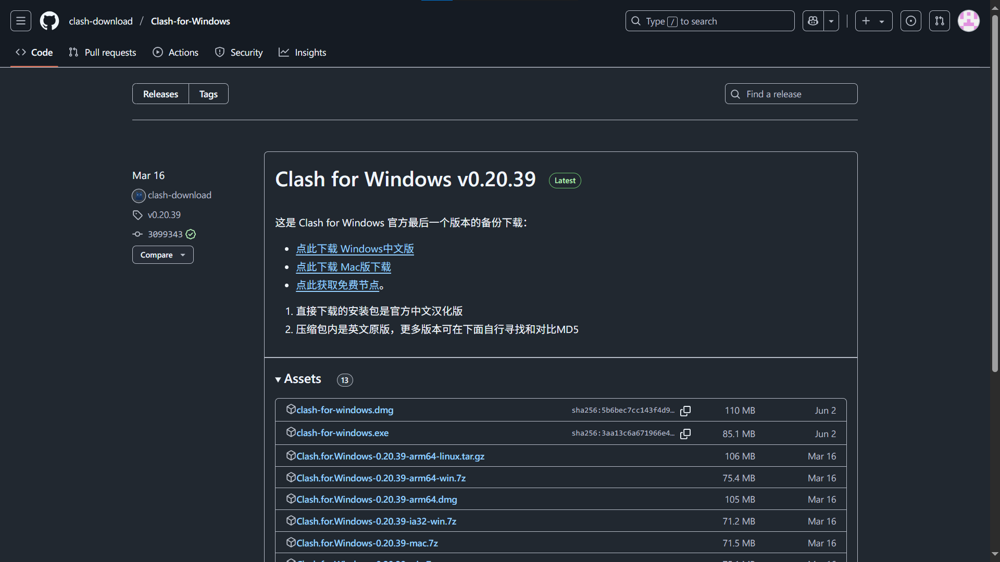
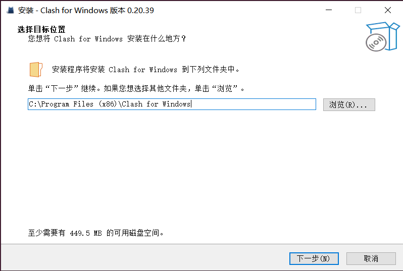
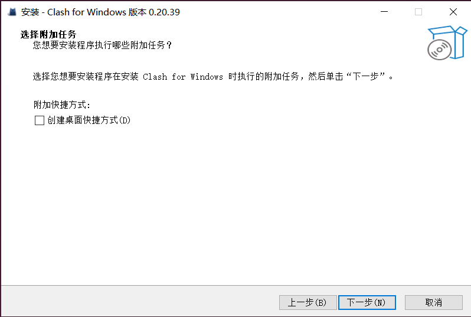
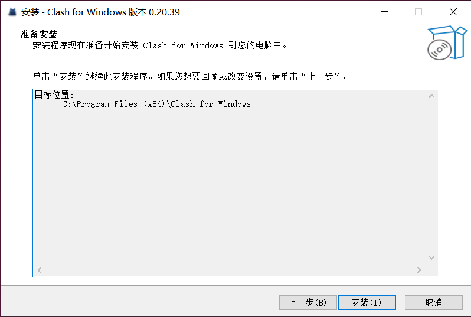
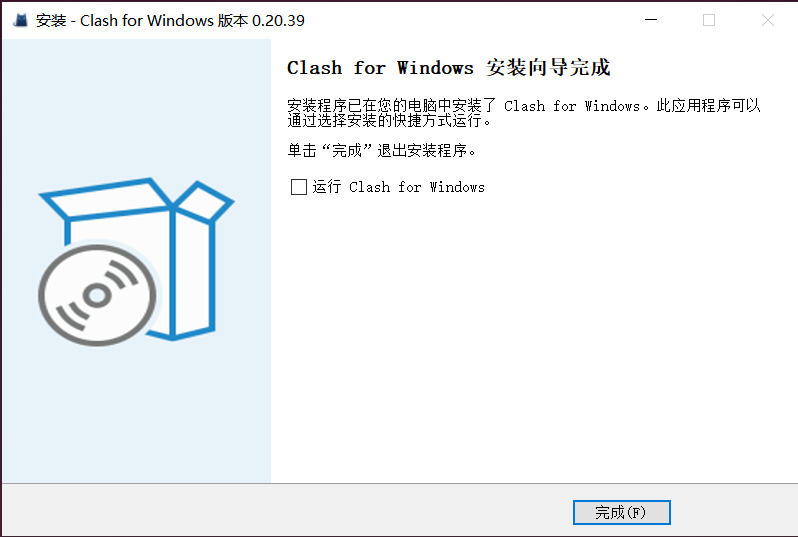
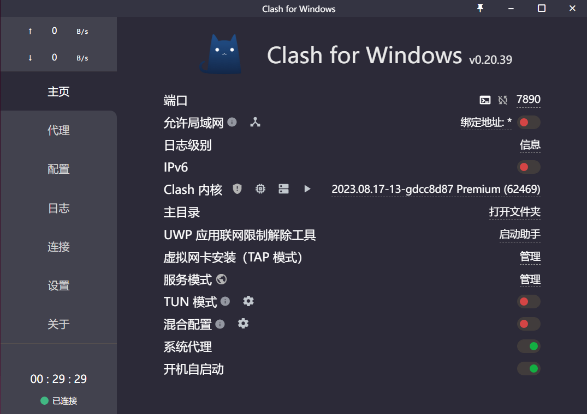
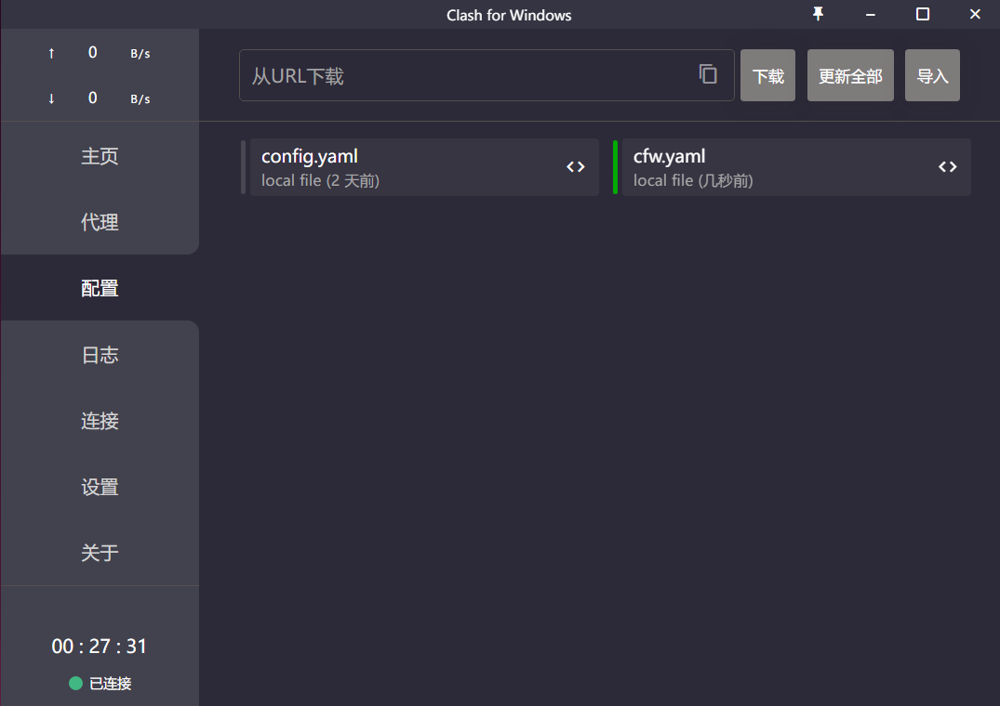
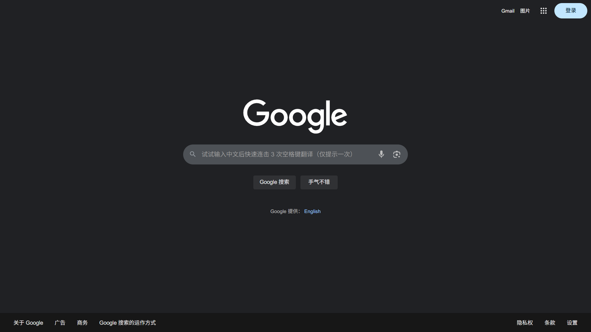

# Clash for Windows
1. [下载](https://gh-proxy.com/github.com/clash-download/Clash-for-Windows/releases/download/v0.20.39/clash-for-windows.exe)

1. 安装  

1. 配置  
打开 “系统代理” “开机自启动”
  
运行 [cfw.bat](cfw.bat) ，导入并选择 cfw.yaml
  
打开 [Google](https://google.com) 测试

